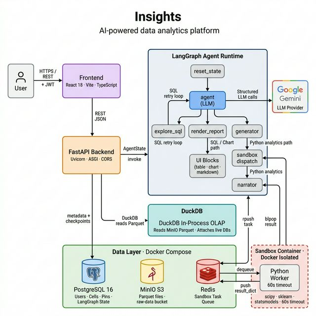

# Insights — AI-Powered Data Analytics Platform
## Project Report

---

**Project Title:** Insights — Conversational Data Analytics Agent  
**Technology Stack:** FastAPI · LangGraph · DuckDB · PostgreSQL · MinIO · Redis · React · Vite · TypeScript  
**Date:** May 2026  

---

## Table of Contents

1. [Introduction](#1-introduction)
2. [Problem Statement](#2-problem-statement)
3. [Objectives](#3-objectives)
4. [Scope of the Project](#4-scope-of-the-project)
5. [System Architecture](#5-system-architecture)
6. [Methodology](#6-methodology)
   - 6.1 [Data Ingestion Pipeline](#61-data-ingestion-pipeline)
   - 6.2 [LangGraph Agentic Orchestration](#62-langgraph-agentic-orchestration)
   - 6.3 [SQL Intelligence with DuckDB](#63-sql-intelligence-with-duckdb)
   - 6.4 [Sandboxed Python Execution Engine](#64-sandboxed-python-execution-engine)
   - 6.5 [AI Narration & Visualization](#65-ai-narration--visualization)
   - 6.6 [Workspace & Multi-Source Analytics](#66-workspace--multi-source-analytics)
   - 6.7 [Dashboard Pinning](#67-dashboard-pinning)
   - 6.8 [Authentication & Security](#68-authentication--security)
   - 6.9 [Frontend Implementation](#69-frontend-implementation)
7. [Tech Stack](#7-tech-stack)
8. [Results and Discussion](#8-results-and-discussion)
9. [Screenshots](#9-screenshots)
10. [Conclusion](#10-conclusion)
11. [Future Scope](#11-future-scope)

---

## 1. Introduction

**Insights** is a full-stack, AI-powered conversational data analytics platform that enables users to ask questions in plain English about their data and receive intelligent answers in the form of rich visualizations, interactive tables, statistical analyses, and narrative summaries. The platform abstracts the complexity of SQL query writing, Python statistical programming, and chart configuration — democratizing data analysis for non-technical users while still providing the depth and flexibility that technical analysts demand.

Unlike traditional BI tools that require pre-built dashboards or static report templates, Insights operates as a context-aware AI agent that dynamically determines the right approach — from a simple SQL aggregation to a full machine learning model — to answer user queries. The system is built on a modern, containerized microservices architecture with a powerful agentic backend and a sleek React-based frontend.

---

## 2. Problem Statement

Data analysis today faces a critical accessibility gap. While organizations collect vast amounts of structured data in databases, spreadsheets, and flat files, the ability to extract meaningful insights remains locked behind specialized skills:

- **SQL expertise** is required even for basic data exploration.
- **Python and statistics knowledge** is needed for correlation analysis, forecasting, clustering, and other advanced analytics.
- **Charting libraries** require significant configuration to produce clean, professional visualizations.
- **BI tools** are expensive, rigid, and often require IT involvement to create new reports.

Business analysts, product managers, and domain experts — who understand the data's business context far better than engineers — are largely excluded from direct data exploration. They are dependent on data engineering teams, creating bottlenecks and delays.

Insights aims to eliminate this barrier by providing a natural language interface where any user can engage directly with their data, regardless of their technical background.

---

## 3. Objectives

The primary objectives of the Insights platform are:

1. **Enable natural language querying** over structured datasets (CSV, Excel, JSON, Parquet) and live relational databases (PostgreSQL, MySQL).
2. **Automate SQL generation and execution** via an intelligent agent that validates queries before presenting results.
3. **Support advanced statistical analytics** (correlations, regressions, clustering, forecasting) using a secure, sandboxed Python execution environment.
4. **Generate rich, interactive visualizations** (bar charts, line charts, pie charts, scatter plots, heatmaps) powered by Vega-Lite.
5. **Provide a notebook-style interface** where users can progressively explore their data across multiple conversational cells.
6. **Support multi-dataset workspaces** enabling cross-dataset analysis within a single conversation.
7. **Allow users to pin key charts** to a personal dashboard for ongoing monitoring.
8. **Ensure data security** through user authentication, per-user data isolation, and sandboxed code execution.
9. **Deliver a scalable, containerized infrastructure** that can be deployed consistently across environments.

---

## 4. Scope of the Project

### In Scope

- User registration, login, and JWT-based authentication.
- Data source management: upload files (CSV, XLSX, JSON, Parquet) or connect live databases (PostgreSQL, MySQL).
- Automatic data profiling upon ingestion (row count, column schema, file size).
- Conversational AI agent for data analytics using LangGraph and Google Gemini / Groq LLMs.
- DuckDB-powered SQL engine for fast, in-process query execution against S3-stored Parquet files and live databases.
- Sandboxed Python execution via a Redis-based task queue and a Docker-isolated worker container.
- Rich UI output blocks: Markdown narrative, interactive tables (with pagination), Vega-Lite charts, Python metric cards, and syntax-highlighted SQL.
- Workspace creation grouping multiple data sources for multi-table analysis.
- Dashboard pinning to save and revisit key chart insights.
- Persistent conversation history (per notebook cell, per data source) using LangGraph PostgreSQL checkpointer.
- Dockerized deployment of all infrastructure services.

### Out of Scope

- Real-time streaming data ingestion.
- Export of results to external formats (PDF, PowerPoint).
- Multi-user collaborative workspaces.
- Fine-tuning of the underlying LLM.
- Mobile application.

---

## 5. System Architecture

The platform follows a **layered architecture** composed of five distinct tiers: a React-based presentation layer, a FastAPI REST API layer, a LangGraph agent runtime, a shared data layer (PostgreSQL + MinIO + Redis), and an isolated sandbox execution container. All services are orchestrated via Docker Compose.

### 5.1 Full System Architecture



The diagram above illustrates the complete application flow:

1. **User → Presentation Layer**: The user interacts with the React SPA via HTTPS. JWT tokens stored in `localStorage` authenticate every request.
2. **Presentation Layer → API Layer**: All UI actions dispatch REST JSON calls to the FastAPI backend, routing through five routers (`auth`, `ingest`, `chat`, `workspace`, `dashboard`).
3. **Ingest Flow**: Uploaded files are converted to Parquet, hashed (SHA-256), stored in MinIO, and their metadata is saved to PostgreSQL.
4. **Chat / Agent Flow**: The `chat_router` or `workspace_router` builds an `AgentState` (including pre-fetched schema context) and invokes the LangGraph `StateGraph`.
5. **LangGraph Agent Loop**: The agent reasoning node (backed by Google Gemini or Groq Llama) selects one of three tools — `explore_sql` (SQL validation loop), `FinalReport` (renders SQL/charts/markdown), or `ExecutePython` (delegates to the Python sandbox).
6. **DuckDB Query Engine**: DuckDB runs in-process inside the backend and reads Parquet data directly from MinIO via S3-compatible endpoint, or attaches live PostgreSQL/MySQL databases using its native extensions — no ETL required.
7. **Sandbox Container Flow**: For Python analytics, the `sandbox_dispatch` node pushes a task (code + serialized DataFrame) onto a Redis queue. The isolated Docker worker picks it up, executes it in a 60-second timeout, and pushes the `result_dict` back. The `narrator` node then interprets the results using a structured LLM call.
8. **Persistence**: LangGraph checkpoints conversation state to PostgreSQL (per-cell thread isolation). All notebook cell outputs and dashboard pins are stored there as well.

---

### 5.3 Key Architectural Decisions

| Decision | Rationale |
|---|---|
| **LangGraph for orchestration** | Provides stateful, conditional multi-step agent graphs with built-in checkpointing |
| **DuckDB as query engine** | In-process OLAP database with native S3/Parquet read support — no data movement needed |
| **MinIO as S3-compatible store** | Self-hosted S3 API for file storage, enabling zero-vendor-lock-in deployment |
| **Redis for sandbox messaging** | Reliable task queue + blocking pop for result retrieval between the FastAPI process and the isolated worker |
| **PostgreSQL for persistence** | Stores users, data source metadata, notebook cells, and LangGraph conversation state |
| **Vega-Lite for charts** | Declarative, grammar-based charting that LLMs can reliably generate without hallucinating visual code |
| **React + TanStack Query** | Reactive UI with server-state caching, optimistic updates, and background refetching |

---

## 6. Methodology

### 6.1 Data Ingestion Pipeline

The ingestion pipeline (`routes/ingest.py`) is responsible for accepting user data in multiple formats and making it queryable by the analytics agent.

**Flow:**

```
User uploads file / provides DB connection
        ↓
  FastAPI /upload endpoint
        ↓
  1. File saved to temporary local storage
  2. Converted to Parquet (if not already):
     - CSV → DuckDB read_csv_auto → COPY TO Parquet
     - Excel → pandas.read_excel → to_parquet
     - JSON → DuckDB read_json_auto → Parquet
     - Parquet → pass-through
  3. File hashed (SHA-256) → deterministic artifact key
  4. Parquet file uploaded to MinIO (bucket: raw-data)
  5. Schema profiled (column names, types, row count, file size)
  6. DataSource record saved to PostgreSQL
        ↓
  Source is now available for agent queries via DuckDB S3 views
```

**Supported Source Types:**

| Type | Mechanism |
|---|---|
| CSV | `DuckDB read_csv_auto` with multi-dialect fallback |
| Excel (.xlsx) | `pandas.read_excel` → Parquet |
| JSON | `DuckDB read_json_auto` → Parquet |
| Parquet | Direct upload |
| PostgreSQL | Live connection via DuckDB postgres extension |
| MySQL | Live connection via DuckDB mysql extension |

For live databases, no files are uploaded — a connection string is stored and DuckDB attaches the database at query time using its native foreign database extension.

---

### 6.2 LangGraph Agentic Orchestration

The core of the application is a **stateful LangGraph graph** (`agent/graph.py`) that implements a ReAct-style agent loop with intelligent routing.

**Graph Structure:**

```
reset_state
    ↓
  agent  ─── explore_sql call ──→ tools ──→ agent (loop)
    │
    ├── FinalReport call ──→ render_report ──→ END
    │
    └── ExecutePython call ──→ generator ──→ sandbox ──→ narrator ──→ END
```

**Node Descriptions:**

| Node | Role |
|---|---|
| `reset_state` | Clears ephemeral per-turn state fields to prevent state leakage across conversation turns |
| `agent` | The main LLM reasoning node; receives schema context, selects tools, generates structured outputs |
| `tools` | Executes `explore_sql` tool calls — runs DuckDB queries and feeds results back to the agent |
| `render_report` | Materializes `FinalReport` tool calls into typed UI blocks (table, chart, markdown) by executing SQL and building Vega-Lite specs |
| `generator` | Generates Python analytics code using a structured LLM call (scipy, sklearn, statsmodels, prophet) |
| `sandbox` | Dispatches generated code to the isolated sandbox worker via Redis and blocks for the result |
| `narrator` | Interprets sandbox output and generates metric cards, charts, and narrative markdown blocks |

**Agent State (`agent/state.py`):**

The `AgentState` TypedDict carries the full conversational context:
- `messages` — LangChain message history (append-only)
- `ui_blocks` — rendered output blocks (custom append reducer)
- `schema_context` — pre-fetched column schema injected into the system prompt
- `workspace_sources` — list of all sources in a workspace (for multi-dataset mode)
- `current_code`, `df_json`, `sandbox_result` — Python execution pipeline state

**Tool Selection Logic:**

The agent uses three tools with a clearly defined decision policy injected via the system prompt:

1. **`explore_sql`** — Always called first to validate SQL before submitting a `FinalReport`. SQL errors are silently retried.
2. **`FinalReport`** — Used for all SQL-expressible queries and ALL visualizations. Contains typed blocks: `markdown`, `table`, `chart`.
3. **`ExecutePython`** — Used exclusively for tasks requiring Python statistical libraries (p-values, ML models, forecasting) that genuinely cannot be expressed in SQL.

---

### 6.3 SQL Intelligence with DuckDB

DuckDB serves as the in-process OLAP query engine. It reads data directly from MinIO (S3-compatible) as Parquet files via views, without requiring any ETL movement.

**View Setup Pattern:**

```python
# For each source, a DuckDB view is created dynamically:
s3_path = f"s3://raw-data/{source['artifact_url']}"
con.execute(f"CREATE OR REPLACE VIEW {view_name} AS SELECT * FROM read_parquet('{s3_path}')")
```

This means the agent can write SQL like `SELECT * FROM housing` and DuckDB transparently reads the Parquet file from object storage.

**Schema Pre-fetching:**

Before each agent invocation, the `generate_schema_context()` function describes all available views/tables to the LLM:

```
View 'housing' (Dataset: Housing Data): Price (DOUBLE), Area (INTEGER), Bedrooms (INTEGER), ...
```

This schema string is injected into the agent's system prompt, enabling it to write correct SQL on the first attempt without needing a discovery loop.

**Chart Block Normalization:**

The `_build_vega_spec()` function translates the flat chart fields the LLM produces into a valid Vega-Lite v6 specification, with dark theme applied via `_apply_dark_theme()`. This tolerates various LLM output structures by accepting fallback field names.

---

### 6.4 Sandboxed Python Execution Engine

For advanced analytics requiring Python libraries (scipy, sklearn, statsmodels, prophet), the system uses a decoupled, Docker-isolated execution model.

**Architecture:**

```
FastAPI Process (Backend)              Sandbox Container (Docker)
─────────────────────────            ──────────────────────────────
generate_code_node                   sandbox_worker.py
  │                                    │
  │ 1. LLM generates Python code       │
  │ 2. Serializes df to JSON           │
  │                                    │
  ▼                                    │
execute_sandbox_node                  │
  │                                    │
  ├──── rpush(TASK_QUEUE, payload) ──►│
  │     {execution_id, code, df_json} │
  │                                    │  ← executes code in restricted env
  │◄─── blpop(result_key, 120s) ──────┤
  │                                    │  ← returns result_dict as JSON
  ▼                                    │
narrator_node                          │
  │ Interprets result_dict             │
  │ Produces UI blocks                 │
```

**Security Model:**
- Code runs inside a separate Docker container (isolated process, network, filesystem).
- 60-second execution timeout enforced by the worker.
- Only JSON-serializable values can be returned (no file access, no model objects).
- The `df` DataFrame is injected as a pre-loaded variable — the code cannot access files or external URLs.

**Python Libraries Available in Sandbox:**
- `pandas` (as `pd`), `numpy` (as `np`)
- `scipy`, `scipy.stats` (as `stats`)
- `sklearn` (scikit-learn)
- `statsmodels.api` (as `sm`)
- `prophet` (from `prophet`)

---

### 6.5 AI Narration & Visualization

The **Narrator node** (`agent/nodes/narrator.py`) bridges the gap between raw numeric output from the Python sandbox and human-understandable insights.

**Process:**
1. The node receives the `result_dict` from the sandbox (e.g., correlation coefficients, p-values, cluster labels, regression parameters).
2. It invokes the LLM with a structured output schema (`NarrationOutput`) that produces typed UI blocks.
3. Three block types are supported:
   - **`markdown`** — Narrative interpretation, "so what?" conclusions in business language.
   - **`metrics`** — Key metric cards with `label`, `value`, and `trend` (up/down/neutral).
   - **`chart`** — Vega-Lite visualizations built from flat field descriptors, with inline data arrays.
4. A raw output collapsible section is always appended for transparency.

The Narrator uses the same flat-field Chart schema approach as the main agent, avoiding hallucinated Vega-Lite JSON. Supported chart types include bar, line, scatter (point), pie (arc), area, and heatmap (rect).

---

### 6.6 Workspace & Multi-Source Analytics

Workspaces allow users to group multiple data sources and query them together as if they were a single analytical environment.

**Implementation (`routes/workspace.py`):**
- A `Workspace` is a named collection linked to multiple `DataSource` records via a many-to-many join table (`WorkspaceDataSource`).
- When a workspace chat is initiated, `generate_schema_context()` loops over all sources and constructs a combined schema string listing each source's view name and columns.
- In the agent's DuckDB execution context, each source is mounted as a separately named view (e.g., `housing`, `sales_data`, `customers`).
- The agent can write SQL that JOINs across these views as if they were tables in the same database.

**Operations:** Create, read, update (rename / change sources), delete.

---

### 6.7 Dashboard Pinning

Users can pin any chart generated during a chat session to their personal dashboard for persistent monitoring.

**Implementation (`routes/dashboard_router.py`):**
- A `DashboardPin` record stores the chart's Vega-Lite spec, data payload, SQL query, title, and explanation.
- Pins are linked to either a `DataSource` or a `Workspace`.
- The dashboard endpoint supports listing (filtered by source/workspace), creating, and deleting pins.
- The frontend renders pinned charts using the same Vega-Lite rendering component used in the notebook.

---

### 6.8 Authentication & Security

**JWT-based Authentication (`routes/auth_router.py`):**
- User registration with bcrypt-hashed passwords.
- Login returns a signed JWT access token.
- All protected endpoints use a `get_current_user` FastAPI dependency that validates the Bearer token.

**Data Isolation:**
- All database queries include `user_id` filters — users can only access their own sources, workspaces, notebook cells, and dashboard pins.
- The `DataSource` ownership is verified before any workspace association is created.

**Conversation State Isolation:**
- Each notebook cell has a unique `cell_id` which is used as the LangGraph `thread_id`. This ensures conversation state (messages, ui_blocks) is isolated per cell, preventing state from bleeding across the notebook.

---

### 6.9 Frontend Implementation

The frontend is a **React + Vite + TypeScript** single-page application with a dark, glassmorphism-inspired design system.

**Pages:**

| Page | Route | Description |
|---|---|---|
| `Auth` | `/` | Login and registration page |
| `DataSources` | `/datasources` | Browse, upload, connect, edit, and delete data sources |
| `DataSourceChat` | `/datasources/:id` | Notebook-style chat interface for a single data source |
| `Workspaces` | `/workspaces` | Create and manage multi-source workspaces |
| `WorkspaceNotebook` | `/workspaces/:id` | Notebook-style chat interface for a workspace |

**Key Libraries:**
- `@tanstack/react-query` — server state management with caching, mutations, and query invalidation.
- `react-router-dom` — client-side routing.
- `vega-embed` — Vega-Lite chart rendering.
- `lucide-react` — iconography.

**UI Block Rendering:**

The notebook renders a heterogeneous list of typed blocks returned by the backend:

| Block Type | Rendered As |
|---|---|
| `markdown` | Styled markdown text |
| `table` | Paginated, sortable data grid with column headers |
| `chart` | Interactive Vega-Lite visualization with dark theme |
| `code` | Syntax-highlighted SQL block |
| `metrics` | Card grid showing labeled key numbers with trend indicators |

---

## 7. Tech Stack

### Backend

| Technology | Version | Purpose |
|---|---|---|
| Python | 3.11+ | Primary backend language |
| FastAPI | 0.135.1 | Async REST API framework |
| Uvicorn | 0.42.0 | ASGI server |
| LangGraph | 1.1.2 | Stateful agent graph orchestration |
| LangChain | 1.2.12 | LLM integration and message types |
| langchain-google-genai | 4.2.1 | Google Gemini LLM integration |
| langchain-groq | 1.1.2 | Groq LLM integration |
| DuckDB | 1.5.0 | In-process OLAP query engine |
| SQLAlchemy | 2.0.48 | Async ORM for PostgreSQL |
| asyncpg | 0.31.0 | Async PostgreSQL driver |
| LangGraph PostgreSQL Checkpointer | 3.0.4 | Persistent conversation state |
| boto3 | 1.42.69 | S3/MinIO client for file storage |
| Redis | 7.3.0 | Sandbox task queue and result store |
| Pydantic | 2.12.5 | Data validation and structured LLM output |
| bcrypt | 5.0.0 | Password hashing |
| python-jose | 3.5.0 | JWT token generation/validation |
| pandas | 3.0.1 | DataFrame manipulation |
| pyarrow | 23.0.1 | Parquet file I/O |
| scipy | — | Statistical functions (sandbox) |
| scikit-learn | — | Machine learning (sandbox) |
| statsmodels | — | Statistical modeling (sandbox) |
| prophet | — | Time series forecasting (sandbox) |

### Frontend

| Technology | Purpose |
|---|---|
| React 18 | UI component framework |
| Vite | Build tool and dev server |
| TypeScript | Type-safe JavaScript |
| TanStack Query | Server state management |
| React Router DOM | Client-side navigation |
| Vega-Lite / Vega-Embed | Declarative chart rendering |
| Lucide React | Icon library |

### Infrastructure

| Service | Technology | Purpose |
|---|---|---|
| Database | PostgreSQL 16 + pgvector | User data, metadata, LangGraph state |
| Object Storage | MinIO | S3-compatible Parquet file storage |
| Cache / Queue | Redis (Alpine) | Sandbox task queue, result delivery |
| Sandbox | Docker container | Isolated Python code execution |
| Containerization | Docker + Compose | Service orchestration |

---

## 8. Results and Discussion

### Capabilities Demonstrated

1. **Natural Language to SQL:** The system reliably translates user questions like *"What is the average price by number of bedrooms?"* into correct DuckDB SQL, validates the query, and renders results as formatted tables and bar charts — all without any user knowledge of SQL.

2. **Advanced Statistical Analysis:** Queries such as *"Calculate the Pearson correlation between all numeric columns"* trigger the Python execution path, producing correlation matrices rendered as Vega-Lite heatmaps with metric cards showing the strongest correlations and their p-values.

3. **Multi-Source Intelligence:** In workspace mode, users can ask questions that span multiple datasets (e.g., *"Join the sales and customer tables and show revenue by region"*), and the agent correctly identifies the right DuckDB views to query.

4. **Persistent Notebook State:** Conversation history persists across sessions via PostgreSQL checkpointing. Users can return to a previous notebook cell and the agent retains full context of the prior conversation thread.

5. **Error Resilience:** SQL errors silently trigger agent retry logic (not visible to the user). The anti-lazy prompt injection pattern ensures the agent rewrites and retries failing queries instead of apologizing to the user.

### Performance Characteristics

- **DuckDB query latency:** Sub-second for most analytical queries over files up to hundreds of megabytes, due to columnar Parquet storage and in-process execution.
- **Python sandbox latency:** 5–45 seconds depending on the complexity of the statistical computation and dataset size (up to 2,000 rows sent to the sandbox).
- **LLM latency:** Typically 2–8 seconds per agent step, depending on the model selected (Gemini Flash vs. Groq Llama).
- **End-to-end response time:** Simple SQL queries resolve in 4–12 seconds. Complex Python analytics take 20–60 seconds.

### Challenges Encountered

1. **LLM Output Normalization:** LLMs inconsistently structure chart outputs. The `_normalize_type()` and `_build_vega_spec()` functions were developed to handle the wide variety of field names and nested structures the model produces, ensuring charts always render correctly.
2. **Stateful Agent Memory:** Without per-cell thread isolation, `ui_blocks` from previous cells would accumulate via the LangGraph append reducer. This was resolved by using the `cell_id` as the `thread_id`, creating a clean state boundary per notebook cell.
3. **CSV Dialect Handling:** A multi-attempt CSV parser with four different DuckDB dialect configurations was implemented to handle comma, semicolon, and pipe-delimited files, as well as files with malformed rows.
4. **Sandbox Serialization:** Ensuring that all Python result objects are JSON-serializable required strict prompt engineering to prevent the LLM from storing numpy arrays, DataFrames, or sklearn model objects in `result_dict`.
---

## 9. Conclusion

**Insights** successfully delivers on its core mission: making data analytics accessible to everyone through the power of large language models and a well-designed agentic system. By combining LangGraph's stateful orchestration, DuckDB's high-performance in-process query engine, and a secure sandboxed Python execution environment, the platform provides a complete analytical capability — from basic data browsing to advanced machine learning pipelines — wrapped in a simple, conversational interface.

The key architectural contributions of this project include:

- A **multi-path agent graph** that intelligently routes queries between SQL execution, Python analytics, and direct conversational responses based on the inherent requirements of each query.
- A **flat-field chart schema** that bridges the gap between LLM output and Vega-Lite rendering, tolerating the natural variability of LLM-structured outputs.
- A **Redis-based task queue** pattern for safely decoupling the FastAPI process from isolated, timeout-bounded Python code execution.
- **Per-cell conversation isolation** via LangGraph thread IDs enabling a true notebook metaphor with independent, persistent conversational contexts.

The system demonstrates that modern AI agents, when properly orchestrated with deterministic tool integrations, can reliably perform non-trivial analytical work that previously required significant human expertise.

---

*End of Report*
